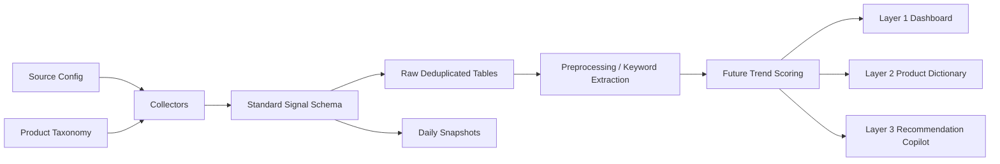

# Architecture

The Stage 1 architecture is intentionally simple but production-shaped.

## Design Principles

- Config-driven source expansion, not hard-coded one-off scraping.
- Stable data contract across sources.
- Append and deduplicate instead of overwriting.
- Daily snapshots for trend history and reproducibility.
- Source-level watermarks for incremental collection.
- API credentials isolated in `.env`.
- Future LLM layers read from processed tables, not raw scraper internals.

## Core Modules

- `pipeline.py`: orchestration and source selection
- `sources/reddit.py`: Reddit posts, comments, search expansion
- `sources/twitter.py`: Twitter/X search and hashtag extraction
- `sources/gtrends.py`: Google Trends interest and related queries
- `sources/public_sources.py`: Hacker News and Google News RSS
- `storage.py`: deduplication, snapshots, state
- `preprocess.py`: cleaning, hashing, keyword extraction
- `taxonomy.py`: product/category/theme CSV normalization

## Future Layers

Layer 1 dashboard should read from processed trend tables, not directly from scrapers.

Layer 2 product dictionary should query product/topic aggregates by product name, category, and related keywords.

Layer 3 copilot should combine trend summaries, product fit, creator inventory, and explanation generation.
